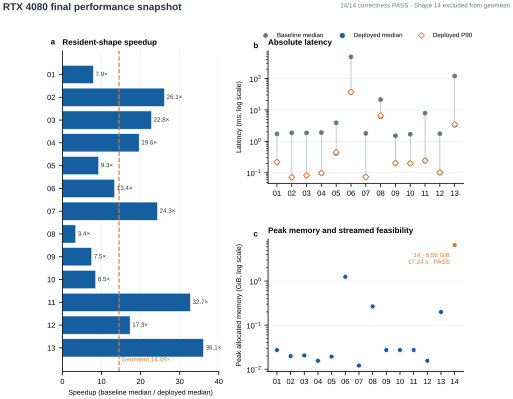
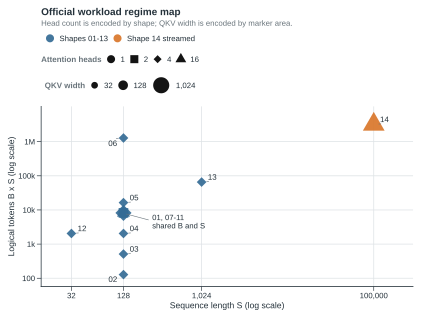

# Learning-Guided Program Search for Shape-Specialized Transformers

This project synthesizes legal Transformer execution programs, measures them on the target GPU, and automatically deploys the fastest correct program for each workload Shape. Instead of extending a hand-written list of named policies, it searches typed compositions of mature PyTorch operators, custom Triton kernels, layouts, precision choices, fusions, runtimes, and launch schedules.

## Latest verified result

The current declared snapshot was measured on an NVIDIA GeForce RTX 4080 under an exclusive GPU lease. All 14 official workloads pass correctness.

| Result | Value |
| --- | ---: |
| Shapes 01–13 geometric-mean speedup | **14.49×** |
| Fastest resident result | Shape 13, **36.09×** |
| Shape 14 streamed latency | **17.24 s** |
| Shape 14 peak allocated memory | **6.56 GiB** |



Speedup is `baseline median / deployed median`. The 14.49× result is the equal-Shape geometric mean for Shapes 01–13. Shape 14 has no materialized dense `S × S` baseline, so it reports correctness, latency, memory, and a project FLOP estimate but is excluded from the speedup aggregate. These are local engineering results, not an official competition score.

- [Full evaluation and per-Shape table](docs/technical_report/04_evaluation_and_results.md)
- [Machine-readable final result](docs/04_最终交付物/01_最终性能测试/result/20260831T083857.848038Z/final_performance.json)

## Why shape specialization matters

The official suite changes batch size from 1 to 10,000, model width from 32 to 1,024, head count from 1 to 16, and sequence length from 32 to 100,000. The dominant cost therefore shifts among launch overhead, matrix throughput, layout conversion, attention working set, memory traffic, and device capacity. One universal execution path is not uniformly optimal.



## Key contributions

- **Typed program synthesis:** `ConfigSpec` represents the whole candidate program; `PlanBuilder` emits one immutable `ExecutionPlan` or rejects it without silent substitution.
- **Learning-guided conditional search:** resident workloads use persistent, constraint-aware, branch-local TPE with fixed-budget survivor racing.
- **Multi-fidelity evidence:** Screen measurements guide search, Enhanced measurements identify one challenger, and Formal measurement compares it with the incumbent.
- **Statistically guarded deployment:** an interleaved group-sequential paired rule promotes only repeatable improvements of at least 2%, with early decisions for large effects.
- **Exact-device routing:** the deployed registry is keyed by the measured runtime environment and full workload fingerprint.
- **Dedicated Shape-14 regime:** a finite no-replacement search feeds a streamed microbatch runtime that avoids a dense 100,000-token attention matrix.
- **Clean GPU measurement:** jobs hold a single-device lease and run Shapes serially in fresh processes.

## System architecture


The end-to-end path is:

```text
official Shape + run variant + detected GPU
                ↓
conditional program space → ConfigSpec → PlanBuilder → ExecutionPlan
                ↓
Screen → Enhanced → locked challenger → paired Formal comparison
                ↓
exact-device deployment registry
                ↓
resident runtime (Shapes 01–13) or streamed runtime (Shape 14)
```

Search persistence and deployment have different roles. Scoped SQLite studies retain detailed reusable evidence; compact JSONL logs retain the decision timeline; `deployment/deployed_configs.json` contains only current measured winners used by the runtime.

## Repository structure

```text
solution/       typed programs, plan compiler, operators, Triton kernels, runtimes
autotune/       search spaces, TPE adapter, staged racing, promotion, outer loop
benchmarking/   correctness, timing, profiling, hardware probe, GPU isolation
deployment/     exact environment identity and deployed configuration registry
official/       immutable benchmark semantics and 14 official Shape definitions
scripts/        one resident and one Shape-14 end-to-end optimization entrypoint
observations/   local persistent studies, compact run logs, benchmark summaries
tests/          tests grouped by production responsibility
docs/           competition rules, engineering guidance, report, and deliverables
cli.py          probe, benchmark, profile, search, and optimize commands
```

The detailed responsibility map is in the [system architecture report](docs/technical_report/02_system_architecture.md).

## Validated environment

The published result uses:

- Windows 11 Pro, Intel Core i7-14700KF, and 63.8 GiB system memory;
- NVIDIA GeForce RTX 4080, compute capability 8.9, 16 GB-class VRAM;
- NVIDIA driver 610.88;
- Python 3.12.5;
- PyTorch 2.12.1+cu132 and CUDA runtime 13.2;
- `triton-windows` 3.7.1.post27;
- Optuna 4.9.0 and Ninja 1.13.0.

For the validated native-Windows environment:

```powershell
python -m venv .venv
.\environments\activate_windows_rtx4080.ps1
python -m pip install -r environments\windows-rtx4080.txt
```

Another platform should install a CUDA-enabled PyTorch build and compatible Triton distribution for that platform before installing `requirements.txt`. The Windows Triton port is not presented as a universal dependency.

## Running the project

GPU commands share one process-level device lease. Resident Shapes and Shape 14 have separate optimization lifecycles and separate persistent search stores.

```powershell
# Inspect the target GPU and runtime
.\.venv\Scripts\python.exe cli.py probe --device cuda:0

# Run bounded resident search-to-deployment optimization
.\scripts\optimize_shapes_01_13.ps1

# Run bounded Shape-14 finite search-to-deployment optimization
.\scripts\optimize_shape_14.ps1

# Benchmark Shapes 01–13 in official order and fresh processes
.\.venv\Scripts\python.exe cli.py benchmark --preset formal --device cuda:0

# Benchmark Shape 14 separately
.\.venv\Scripts\python.exe cli.py benchmark --group shape14 --preset smoke --device cuda:0

# Profile one explicit generated configuration
.\.venv\Scripts\python.exe cli.py profile `
  --case-id official_01 `
  --config path\to\config.json `
  --device cuda:0
```

The resident script defaults to Shapes 01–05 and 07–13 because Shape 06 is much more expensive to measure. Pass `-IncludeShape06` when a new large-batch mechanism warrants that cost. Re-running either script resumes compatible studies rather than starting from zero.

[`cli.py`](cli.py) is the development and search interface. [`torch_transformer_benchmark.py`](torch_transformer_benchmark.py) is the separate bridge to the immutable official benchmark implementation.

## Technical report

The English report is split into five focused documents plus an index:

1. [Problem framing and contributions](docs/technical_report/01_problem_and_contributions.md)
2. [System architecture](docs/technical_report/02_system_architecture.md)
3. [Search and optimization method](docs/technical_report/03_search_and_optimization_method.md)
4. [Evaluation and results](docs/technical_report/04_evaluation_and_results.md)
5. [Environment, AI tools, and limitations](docs/technical_report/05_environment_ai_tools_and_limitations.md)

The report's architecture, performance, and workload figures are generated from repository data as editable SVG/PDF assets. Its AI disclosure now includes the human-guidance method and two representative, evidence-linked interaction histories. A dedicated result-reproduction section is intentionally deferred to a later owner-guided submission revision.

## AI tool disclosure

OpenAI Codex was the primary implementation, refactoring, testing, and multi-agent coordination environment. A separate ChatGPT GPT-5.6 sol Pro workflow provided deep repository and methodology reviews, and Deep Research supported broader method exploration. Actually used Skills include Stop That Shit, Deep Research, Browser Control, and Nature Figure. The project does not claim to implement an autonomous LLM Agent runtime; search, correctness, measurement, promotion, and deployment are deterministic program operations.

See [Environment, AI tools, and limitations](docs/technical_report/05_environment_ai_tools_and_limitations.md) for the bounded disclosure, decision-ownership model, and representative interactions used in this draft.

## Limitations and next steps

- Performance has been validated only on the disclosed RTX 4080/Windows stack.
- The official MFU weights, useful-FLOP definition, bandwidth correction, and final aggregation protocol have not been published; this repository does not claim an official score.
- Shape 14 has no dense baseline speedup and uses a separate streamed protocol.
- The final snapshot currently covers FP32 input/output, zero padding, and unit input scale.
- Search quality is bounded by the currently implemented operator and Kernel vocabulary and by a 36-branch resident structure cap per run.
- Cross-hardware infrastructure is retained, but another GPU needs fresh measurement and deployment rather than inheriting RTX 4080 results.

## Submission links

- Devpost project page: **[To be added before submission]**
- Public demo video: **[YouTube URL to be added before submission]**

## Team contributions

**[Team contribution statement to be completed before submission.]**
