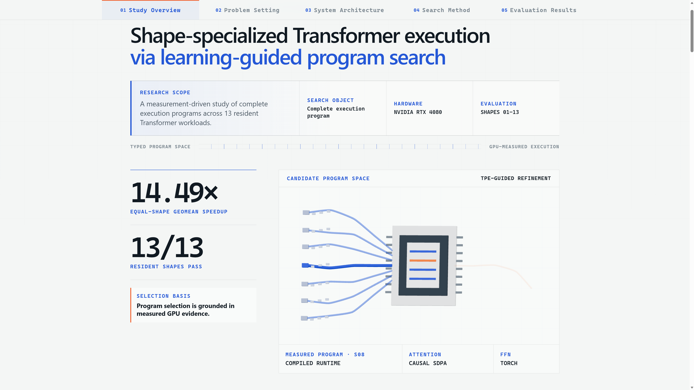

# Learning-Guided Program Search for Shape-Specialized Transformers

**TikTok TechJam 2026 · Hardware Efficiency**

This project generates complete Transformer execution programs, verifies them against the supplied semantics, measures them on the target GPU, and selects a measured winner for each official workload Shape. The key difference is that it searches compositions of operators, Triton kernels, layouts, precision choices, fusions, runtimes, and schedules rather than extending a hand-written list of policy names.

[Three-minute video demo](https://youtu.be/rItQ3x4iHBc) · [Verified results](#verified-results) · [Quick reproduction](#quick-reproduction) · [System overview](#system-overview) · [Technical report](docs/technical_report/README.md) · [Machine-readable result](result/20260831T083857.848038Z/final_performance.json)

> **Interactive project walkthrough:** [Open the GitHub Pages demo](https://wendystar0628.github.io/ML-Guided-Program-Search-for-Shape-Specialized-Transformer-Optimization/) for a concise visual tour of the project outcome, workload geometry, system architecture, learning-guided search, and measured results.

[](https://wendystar0628.github.io/ML-Guided-Program-Search-for-Shape-Specialized-Transformer-Optimization/)

## Verified results

The declared snapshot was measured locally on an NVIDIA GeForce RTX 4080. Shapes 01–13 pass the supplied full comparator and achieve a **14.49× equal-Shape geometric-mean speedup over the official PyTorch baseline**.

| Evidence | Result |
| --- | ---: |
| Resident correctness | **13/13 PASS** with the supplied comparator |
| Shapes 01–13 geometric-mean speedup | **14.49×** |
| Resident speedup range | **3.41×–36.09×** |
| Shape 14 correctness evidence | **Local B=1 semantic PASS; official B=32 I/O pending** |
| Shape 14 full logical `B=32` streamed latency | **17.24 s** (one final sample) |
| Shape 14 streamed inner-forward peak allocation | **6.56 GiB** at `B=2` |


Speedup is `baseline median / deployed median`; Shape 14 is excluded because a dense `S × S` baseline was not executed.

The geometric mean gives every resident Shape equal weight in log-speedup space: `log G` is the arithmetic mean of the per-Shape `log speedup`. This is the standard aggregation for multiplicative benchmark ratios; the full range and per-Shape results remain visible because one aggregate cannot describe workload variability.

### Shape 14: what ran


Shape 14 (`B=32`, `S=100,000`, `D=1,024`, 16 heads, two layers) is measured as sixteen ordered, distinct `B=2` inner forwards. Each inner forward computes causal attention in `64 × 64` Q/KV tiles, maintains online softmax statistics, emits one output chunk, and discards its score tiles; no global `[B, H, S, S]` tensor is materialized. The final timing harness keeps only a compact sampled summary between chunks.

**Evidence boundary.** One complete 16-chunk loop took **17.244 s**. The final preset records one repeat, so this is single-sample latency rather than tail-latency evidence. The **6.56 GiB** figure is maximum allocated memory for one `B=2` inner forward—not allocator-reserved memory or a materialized `B=32` peak. A local `B=1` check passed the supplied tolerance logic; the sampled digest is only an execution reproducibility marker, the official `B=32` I/O pair remains unavailable, and no dense-baseline speedup is claimed.

These are local engineering results, not an official competition score. See the [human-readable result](result/20260831T083857.848038Z/final_performance.md) and [evaluation protocol](docs/technical_report/04_evaluation_and_results.md) for the complete per-Shape evidence and measurement boundaries.

## Problem, approach, and impact

The 14 official workloads vary batch size from 1 to 10,000, model width from 32 to 1,024, head count from 1 to 16, and sequence length from 32 to 100,000. Their bottlenecks shift among launch overhead, matrix throughput, layout conversion, attention working set, memory traffic, and device capacity. A single universal execution path is therefore not uniformly optimal.

The project addresses this with three connected ideas:

1. **Search executable programs, not policy labels.** A typed configuration describes the complete execution choice; invalid combinations are rejected before GPU work.
2. **Learn from staged hardware evidence.** Cheap Screen measurements guide persistent conditional search, stronger candidates receive Enhanced measurement, and only a formally compared improvement can replace the current local winner.
3. **Treat the extreme long-sequence case separately.** Shape 14 uses bounded streamed execution and online attention so no global 100,000-token score matrix is stored.

This approach targets a practical gap between generic library defaults and the best program for a real device and workload. It can help developers make consumer or edge GPUs more useful for fixed Transformer workloads while preserving an auditable correctness-and-measurement trail. The current evidence is limited to the disclosed RTX 4080 system; portability is an architectural goal, not a measured claim.


*The deployed program is a measured composition, not a policy label. Each row shows the runtime, attention, output-layout, projection, FFN, normalization/fusion, and precision choices selected for one official Shape; Shape 14 forms a separate streamed regime.*

### Which mechanisms support the measured gains?


The left panel anchors every resident Shape (01–13) to its complete deployed speedup over the official baseline. The right panel replaces one mechanism family with its nearest legal fallback and reports the percentage of complete performance retained:

`retained performance = ablated speedup / complete speedup = deployed median / ablated median`.

`100%` means no measurable change, a lower percentage means the removed family was more important, and a value above `100%` means the legal fallback was faster in this compact run.

These percentages are leave-one-family-out sensitivities, not additive component shares: runtime, layout, fusion, and precision choices interact, and some legal counterfactuals require a dependency closure. The measured pattern is nevertheless clear. Runtime scheduling is the largest broad dependency for most small and medium resident Shapes; norm/boundary specialization is the next most consistently material family; attention matters most for Shapes 07, 11, and 13; and the independently isolatable projection/precision path is critical for Shapes 05 and 08. The [evaluation report](docs/technical_report/04_evaluation_and_results.md#44-coherent-mechanism-family-ablation) documents the protocol and interpretation boundaries.

## System overview


The main loop is **construct → reject illegal plans → measure → compare → register the approved winner → execute**. Shapes 01–13 use persistent conditional TPE studies; Shape 14 uses a separate finite streamed search. Screen, Enhanced, and Formal stages spend increasing measurement effort only on progressively stronger evidence.

Here, “deployment” means local runtime selection through an environment-matched registry, not production serving infrastructure. A committed winner is selected only when the measured runtime signature and complete workload fingerprint match; another environment falls back to a portable configuration instead of assuming the RTX 4080 result transfers.

### Why the optimizer is principled

The search combines three established ideas rather than relying on blind enumeration:

- **Conditional TPE:** within each structurally compatible branch, TPE separates better and remaining Screen observations, estimates densities `l(x)` and `g(x)`, and favors candidates with a high `l(x)/g(x)` ratio—the expected-improvement ranking derived for TPE. Accuracy, execution-path, and runtime violations are exposed to the constrained sampler instead of being treated as valid wins.
- **Fixed-budget racing:** inexpensive evidence first covers legal structures; the remaining budget is concentrated on the best measured branches while a small reserve protects under-sampled alternatives. This transfers the best-arm-identification resource-allocation principle without claiming that the project's budget constants are theoretically optimal.
- **Sequential paired promotion:** Formal blocks alternate incumbent/challenger order. Clear improvements may promote after 6 or 9 blocks; gains near the `1.02×` minimum-effect gate require up to 13. Under the documented independent-block sign-test null, the pre-specified three-look rule has the conservative per-comparison bound `P(false promotion) ≤ 1/64 + 10/512 + 92/8192 = 0.0464 < 0.05`.

The last bound applies to one Formal challenger comparison under its stated assumptions; it is not a project-wide confidence level. The [search method](docs/technical_report/03_search_and_optimization_method.md) gives the derivations, implementation correspondence, and theoretical boundaries.

## Quick reproduction

Reproducing the declared result does **not** require rerunning autotuning.

The validated path requires Windows 11 PowerShell, Python 3.12, an NVIDIA RTX 4080-class CUDA device, CUDA Toolkit 13.2 in its default location, and Visual Studio C++ Build Tools. The repository has no project-wide ahead-of-time build step: PyTorch, Triton, and compiled paths build lazily on first use, and compilation/first-run work is excluded from timed samples.

```powershell
git clone https://github.com/Wendystar0628/Learning-Guided-Program-Search-for-Shape-Specialized-Transformers.git
cd Learning-Guided-Program-Search-for-Shape-Specialized-Transformers

py -3.12 -m venv .venv
.\environments\activate_windows_rtx4080.ps1
python -m pip install -r environments\windows-rtx4080.txt
```

Run the unit tests and low-cost pipeline check first:

```powershell
python -m pytest -q
.\.venv\Scripts\python.exe scripts\run_final_performance.py --preset smoke
```

Then reproduce the declared measurement:

```powershell
.\.venv\Scripts\python.exe scripts\run_final_performance.py --preset final
```

The runner executes resident Shapes and Shape 14 as serial tasks. Each task acquires the same project-local GPU lease, and each Shape runs in a fresh process. The lease coordinates this project only, so close video playback, model servers, and other GPU workloads manually. Results are appended under:

```text
result/<UTC completion time>/
  final_performance.json
  final_performance.md
```

On a matching measured environment, expect Shapes 01–13 to remain near the declared 14.49× geometric mean; exact latency varies with clocks, temperature, driver state, and background load. A different GPU/software signature intentionally uses a portable fallback and is not expected to reproduce the RTX 4080 number. The [result guide](result/README.md) explains presets and output fields.

## Optional optimization workflow

Use these commands only to search for new local winners; they are not part of result reproduction.

```powershell
# Bounded search-to-registry loop for Shapes 01–05 and 07–13
.\scripts\optimize_shapes_01_13.ps1

# Add the expensive large-batch Shape 06 when testing a new mechanism
.\scripts\optimize_shapes_01_13.ps1 -IncludeShape06

# Independent bounded Shape-14 search
.\scripts\optimize_shape_14.ps1
```

Compatible studies resume from local persistent evidence. See the [search method](docs/technical_report/03_search_and_optimization_method.md) and `python cli.py --help` for the search, benchmark, profile, and probe interfaces.

Run the report-facing, evidence-only component ablation separately. It measures all resident Shapes 01–13 in serial fresh processes and never updates the deployment registry:

```powershell
.\.venv\Scripts\python.exe scripts\run_component_ablation.py
```

## Repository guide

```text
solution/       typed programs, plan compiler, operators, kernels, runtimes
autotune/       conditional search, staged evidence, promotion, outer loop
benchmarking/   correctness, timing, profiling, hardware and GPU isolation
deployment/     measured-environment identity and current local winners
official/       supplied benchmark semantics and 14 official Shapes
scripts/        optimization and final-result entrypoints
result/         timestamped final-performance and report-facing ablation artifacts
tests/          tests grouped by production responsibility
docs/           English technical report and official-material translations
```

`observations/` is generated locally for studies and diagnostic history and is intentionally excluded from GitHub.

## Technical report and disclosure

The English technical report separates the judge-facing argument from implementation detail:

1. [Problem framing and contributions](docs/technical_report/01_problem_and_contributions.md)
2. [System architecture](docs/technical_report/02_system_architecture.md)
3. [Search and optimization method](docs/technical_report/03_search_and_optimization_method.md)
4. [Evaluation and results](docs/technical_report/04_evaluation_and_results.md)
5. [Environment, AI tools, and limitations](docs/technical_report/05_environment_ai_tools_and_limitations.md)

| Item | Used in this project |
| --- | --- |
| Core runtime and search libraries | PyTorch, Triton, Optuna, Ninja |
| Supplied assets | Official PyTorch benchmark semantics and 14 workload Shapes |
| External dataset or hosted runtime API | None; inputs are generated by the supplied benchmark path |
| AI tools and models | OpenAI Codex; ChatGPT GPT-5.6 sol Pro; Deep Research |
| Actually used Skills | Stop That Shit, Deep Research, Browser Control, Nature Figure |

The human participant set the problem framing, architecture directions, constraints, priorities, and acceptance decisions. AI tools expanded those directions into implementable alternatives, inspected evidence, implemented changes, and reported measured feedback. The detailed decision-ownership model and two representative interaction histories are documented in the [AI collaboration disclosure](docs/technical_report/05_environment_ai_tools_and_limitations.md).

## Scope and next steps

Current limitations are intentionally explicit:

- the measured evidence covers one RTX 4080/Windows system and a competition-defined forward Transformer core, not training, KV-cache decoding, distributed execution, or production serving;
- roughly 12 hours of cumulative search explored only part of the combinatorial program space, so the committed plans are best-so-far results rather than proven global optima;
- because the remaining competition time was limited, the evaluation includes complete-deployment measurements and one-family-at-a-time legal knockouts, but not the full combinatorial ablation needed to quantify higher-order interactions or additive contribution shares;
- search is an offline process constrained by the implemented operator and Kernel vocabulary, and the project has not learned a transferable cross-device performance model.

With more time, the highest-value next steps are to validate Shape 14 against the final official full-batch I/O artifact, add genuinely new executable Kernel families where profiling shows remaining headroom, and collect multi-device evidence for a transferable cost model. Full boundaries and longer-term work are in the [limitations section](docs/technical_report/05_environment_ai_tools_and_limitations.md#57-limitations).

## Competition deliverables

- Source code, setup, compilation, and run instructions: this repository and README.
- Written technical report: [`docs/technical_report/`](docs/technical_report/README.md).
- Timestamped final evidence: [`result/`](result/README.md).
- AI tools, models, Skills, human guidance, and representative interactions: [technical report §5](docs/technical_report/05_environment_ai_tools_and_limitations.md).
- Public three-minute demo: [watch on YouTube](https://youtu.be/rItQ3x4iHBc).
- Devpost project page: to be linked after publication.
