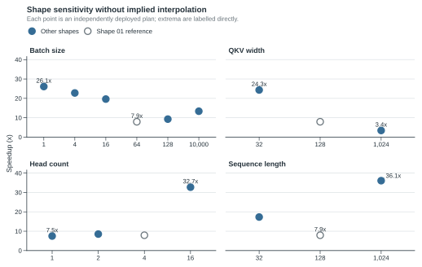

# 1. Problem Framing and Contributions

## 1.1 Challenge

The official benchmark evaluates the same pre-normalized Transformer semantics over 14 public Shapes. Each layer contains multi-head causal self-attention, residual connections, exact GELU feed-forward computation, and LayerNorm. Input and output semantics remain FP32, while an implementation may use lower precision internally only when every output element passes the official absolute-or-relative tolerance.

The Shapes vary batch size from 1 to 10,000, model width from 32 to 1,024, head count from 1 to 16, and sequence length from 32 to 100,000. These changes alter the relative importance of launch overhead, matrix throughput, attention working set, layout conversion, memory traffic, and total device capacity. A single fixed implementation is therefore unlikely to be uniformly best.

*Figure 1. The 14 official workloads span distinct launch-overhead, matrix-throughput, attention-working-set, and device-capacity regimes, motivating Shape-specialized execution.*

*Figure 2. Independently deployed programs respond non-monotonically to batch size, width, head count, and sequence length; these points are descriptive Shape evidence rather than causal Kernel ablations.*

The sensitivity panels are descriptive rather than causal ablations: each point uses its independently deployed plan. Their non-monotonic response is exactly the reason the project treats Shape as part of the optimization problem.

## 1.2 Core insight

The optimization target is not a name such as “graph” or “fused attention.” It is a complete executable program:

- which attention, projection, FFN, norm, and boundary implementations are used;
- which layouts and intermediate materializations exist;
- where lower precision is introduced and restored;
- which operations are compiled or captured;
- which launch, tile, warp, batch-tile, and microbatch parameters are selected.

This project therefore searches a typed program representation rather than routing among a manually extended catalogue of policy names. Handwritten Triton kernels and mature PyTorch operators remain reusable implementation primitives; the candidate programs that combine them are generated and validated by code.

## 1.3 Contributions

1. **Typed program synthesis.** A `ConfigSpec` separates structural program choices from schedule choices. `PlanBuilder` compiles a configuration into one immutable `ExecutionPlan` or rejects it with structured violations. It does not silently replace an invalid request with another policy.
2. **Learning-guided conditional search.** Resident workloads use independent, persistent, constraint-aware TPE studies for structurally compatible branches. Search effort is concentrated through fixed-budget survivor racing while a small exploration reserve protects under-sampled structures.
3. **Multi-fidelity GPU evidence.** Cheap Screen measurements train the sampler; selected candidates receive Enhanced measurement; one locked challenger enters a fresh Formal comparison against the deployed incumbent.
4. **Statistically guarded automatic deployment.** Interleaved incumbent/challenger blocks support early promotion for clear improvements and longer evidence for small effects. Only an approved Formal winner updates the exact-device registry.
5. **Separated capacity regime for Shape 14.** The 100,000-token workload uses an independently stored finite search and a streamed microbatch runtime rather than pretending it is an ordinary resident Shape.
6. **Mature-library and custom-kernel balance.** PyTorch, native SDPA, CUDA Graph, TorchInductor, and compiled execution are combined with focused Triton kernels for attention, projection, FFN, normalization, and cross-operator boundaries.
7. **Clean measurement boundary.** GPU work is serialized by a device lease, and each Shape is measured in a fresh process to reduce allocator, compilation, CUDA Graph, and model-state leakage.

## 1.4 Competition relevance

The system addresses the competition at three levels. It produces measurable Kernel and execution-path improvements for the disclosed device; it demonstrates a reusable method for converting hardware and workload differences into executable program choices; and it retains enough cross-hardware infrastructure for a new device to be searched rather than forced to inherit RTX 4080 conclusions. Performance claims in this report remain limited to the hardware on which they were actually measured.
