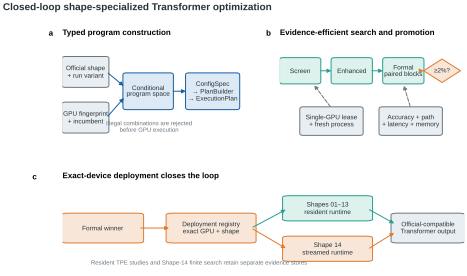
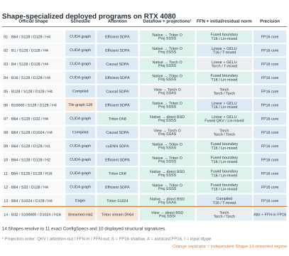

# 2. System Architecture

## 2.1 Architectural overview

The architecture closes one evidence loop: generated programs are statically validated, executed under GPU isolation, compared with the incumbent, written to an exact-device registry only after Formal approval, and then consumed by the same runtime implementation that was benchmarked.

## 2.2 Responsibility boundaries

| Layer | Repository area | Responsibility |
| --- | --- | --- |
| Program representation | `solution/config.py`, `solution/plan.py` | Typed configuration and immutable execution plan |
| Static compilation | `solution/plan_builder.py` | Shape, capability, layout, precision, fusion, and runtime legality |
| Runtime execution | `solution/transformer.py`, `solution/operators/`, `solution/kernels/`, `solution/runtimes/` | Execute the selected plan without a second policy lookup |
| Program search | `autotune/search_space.py`, `autotune/search_engine.py` | Generate structures, sample schedules, and race candidates |
| GPU measurement | `benchmarking/` | Correctness, CUDA-event timing, P90, memory, device lease, and fresh processes |
| Promotion and deployment | `autotune/promotion.py`, `deployment/` | Sequential paired decision and exact environment/Shape registry |
| Entrypoints and evidence | `cli.py`, `scripts/`, `observations/` | Bounded workflows, persistent studies, and compact decision timelines |

This division prevents candidate identity, runtime behavior, and deployment state from being reinterpreted independently by several modules.

## 2.3 Runtime flow

1. The official Shape and run variant define the execution context.
2. A detected environment fingerprint records the GPU, driver, CUDA runtime, PyTorch, Triton, math mode, official definitions, and relevant solution scope.
3. The deployment registry resolves an exact environment-and-Shape incumbent. When no measured entry exists, the runtime uses a conservative executable fallback.
4. `ProgramSearchSpace` generates resident structures and their active schedule domains. Shape 14 uses its own finite `Shape14SearchSpace`.
5. `PlanBuilder` either emits one immutable `ExecutionPlan` with an expected trace or rejects the configuration before it consumes benchmark time.
6. The model executes library operators, Triton kernels, and runtime wrappers named by the plan. The actual trace is compared with the expected trace, so a fallback cannot masquerade as the candidate under test.
7. Screen, Enhanced, and Formal measurements produce constrained evidence. A Formal winner replaces only the matching entry in `deployment/deployed_configs.json`.
8. Ordinary model construction resolves the updated registry, completing the loop.

## 2.4 Resident execution

Shapes 01–13 use resident execution and may combine:

- PyTorch linear algebra and causal scaled-dot-product attention;
- native or mixed-precision attention backends;
- Triton kernels for Dh8 and S1024/Dh32 attention cases;
- QKV materialization and attention-output bridges;
- exact-GELU and fused linear/GELU paths;
- initial, residual, masked, and cross-boundary normalization fusions;
- eager, compiled, CUDA Graph, or batch-tiled CUDA Graph runtimes.

These are program building blocks, not a list of complete hand-authored policies. Only combinations whose preconditions are accepted by `PlanBuilder` become runnable candidates.

The deployed RTX 4080 snapshot resolves the 14 official Shapes to 11 exact `ConfigSpec` values and 10 displayed structural signatures. The matrix uses text as the primary encoding and color only for grouping: the deployed unit is a complete generated program spanning schedule, attention, dataflow, projections, FFN, normalization, and precision—not a single manually named policy.

## 2.5 Shape 14 as a separate execution regime

Shape 14 has `B=32`, `S=100000`, `D=1024`, 16 heads, and two layers. Materializing a dense attention score tensor would be impractical on the validated 16 GB-class GPU. The project therefore separates its lifecycle:

- a 34-point finite search is enumerated without replacement;
- the space contains two Triton streaming-Dh64 branches and one native causal-SDPA branch with bounded microbatch choices;
- the logical batch is executed as ordered, distinct microbatches into one preallocated output tensor;
- the streamed attention kernel processes causal blocks without storing a full `S × S` matrix;
- search evidence, deployment scope, optimization script, and benchmark protocol are separate from resident workloads.

The branch rejoins the common system only at Formal comparison, deployment, and the official-compatible output boundary. This is a necessary capacity distinction, not an unrelated second architecture.

## 2.6 Isolation and evidence storage

All GPU-facing CLI operations acquire one process-level device lease. Shape suites run serially, with one fresh process per Shape. Persistent evidence is intentionally minimal but useful:

- `observations/search/resident/search.sqlite3`: resident Screen and reusable Enhanced evidence;
- `observations/search/shape14/search.sqlite3`: streamed finite-search evidence;
- scoped JSONL logs: coverage, failures, stage durations, locked challenger, paired ratios, and deployment decision;
- `deployment/deployed_configs.json`: current exact-device winners only, not history.
