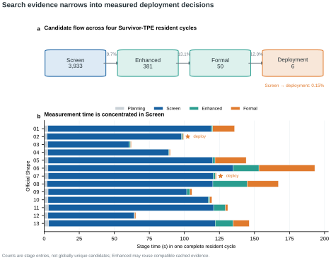

# 3. Search and Optimization Method

## 3.1 Search object

A candidate is represented as:

\[
\text{ConfigSpec} = \text{ProgramConfig} + \text{ScheduleConfig}.
\]

`ProgramConfig` describes the computation graph: attention backend, precision, layout/materialization, output bridge, FFN implementation, normalization and fusion. `ScheduleConfig` describes execution details such as runtime backend, compile mode, Triton tile/warp/stage parameters, batch tiling, and microbatch size. A stable configuration identifier follows from the complete typed value.

For Shape \(s\), the measured search problem is the constrained black-box objective

\[
\min_{x\in\mathcal{X}_s}\; \operatorname{median} T_s(x)
\quad \text{subject to} \quad
g_{acc}(x)\le 0,\; g_{path}(x)\le 0,\; g_{run}(x)\le 0.
\]

Here \(x\) is a complete `ConfigSpec`. Static `PlanBuilder` checks remove structurally illegal points before GPU work; the three measured constraints then encode comparator accuracy, expected-versus-actual execution-path agreement, and runtime feasibility. This formulation makes the optimization target explicit without assigning invalid programs an attractive synthetic latency.

## 3.2 Generated resident search space

The resident generator forms high-level structures from legal primitive products, applies semantic and hardware constraints, and exposes only their active schedule axes. Each run keeps at most 36 branches: mandatory and incumbent-compatible structures first, then primitive and pairwise coverage with a seed-rotated remainder.

This bounded covering design is not exhaustive enumeration. Repeated cycles rotate optional structures; Kernel guards define legal domains without hard-coding a complete winning program. Sections 3.3–3.7 describe resident search; Shape 14 uses the finite regime in Section 3.8.

## 3.3 Constraint-aware branch-local TPE

Different structures expose different parameters, so each branch owns an independent persistent constrained multivariate Optuna TPE study. Startup size is:

\[
n_{startup}=\min(10, |\mathcal{X}_{branch}|).
\]

Only Screen measurements train TPE. The minimized objective is measured median latency, while three constraint coordinates separately encode:

1. comparator accuracy violation;
2. expected-versus-actual execution-path disagreement;
3. runtime feasibility.

Let \(y^*\) be the TPE split threshold for observed Screen latency \(y\). The original TPE construction models

\[
\ell(x)=p(x\mid y<y^*),\qquad
g(x)=p(x\mid y\ge y^*).
\]

For a minimization problem, its expected-improvement criterion is proportional to

\[
\left[\gamma+(1-\gamma)\frac{g(x)}{\ell(x)}\right]^{-1},
\qquad \gamma=p(y<y^*),
\]

so candidate ranking favors a large \(\ell(x)/g(x)\). The project delegates this estimator to Optuna's constrained, multivariate, grouped [`TPESampler`](https://optuna.readthedocs.io/en/stable/reference/samplers/generated/optuna.samplers.TPESampler.html); keeping one persistent study per structural branch avoids fitting one density model across incompatible active parameters. This is sequential model-based optimization, not a Gaussian-process posterior or a learned cross-Shape performance model.

Duplicate zero-information proposals are not rewarded or assigned synthetic timing. They are replaced by an unseen finite point when one remains.

## 3.4 Fixed-budget survivor racing

The per-Shape wall-time budget uses cumulative soft deadlines at 65% for Screen, 82% for Enhanced, and 100% for Formal; an evaluation already in flight may finish. Every mandatory structure first receives a Screen witness, then branches are ranked by their best feasible Screen median.

With a trial cap, the largest ranked survivor prefix that can reach TPE startup and receive at least one guided proposal is selected. Roughly 10% of the remaining trial budget is reserved for least-sampled alternatives, while the rest is distributed round-robin over survivors. Without a trial cap, all branches stay active until the soft deadline.

The resulting **fixed-budget survivor TPE** transfers the best-arm-identification principle: spread cheap evidence broadly, then concentrate measurements on promising alternatives while retaining an exploration floor. Fidelity changes the GPU measurement protocol rather than training resources, and the chosen 65/17/18 split carries no published regret or sample-complexity guarantee.

## 3.5 Multi-fidelity selection

| Fidelity | Purpose | Persistence |
| --- | --- | --- |
| Screen | Broad, inexpensive candidate evidence and TPE training | Stored in the branch study |
| Enhanced | Remeasure a small feasible frontier with a stronger protocol | Reused only when evidence identities match |
| Formal | Lock one challenger and compare it with the incumbent | Always measured again |

For resident Shapes, the fastest 20% of eligible Screen candidates, capped at eight, advance to Enhanced. Shape 14 advances only its best Screen candidate because one full logical-batch evaluation dominates wall time. The fastest feasible Enhanced candidate is locked before Formal measurement, preventing post-hoc challenger selection from the Formal samples.

*Figure 5. Four resident optimization cycles reduce 3,933 Screen stage entries to 381 Enhanced entries, 50 Formal comparisons, and six deployment updates, while Screen measurement consumes most observed stage time.*

Screen measurement dominates wall time for most Shapes, which is where branch-local TPE and survivor allocation must spend budget carefully. The figure reports stage entries rather than globally unique programs; compatible Enhanced evidence may be reused, so it is an auditable funnel rather than a project-wide convergence curve.

## 3.6 Sequential paired promotion

Formal comparison alternates incumbent/challenger ordering in paired blocks. Each block produces the ratio

\[
r_i = \frac{\operatorname{median}(T_{incumbent,i})}
           {\operatorname{median}(T_{challenger,i})}.
\]

The pre-specified group-sequential rule is:

| Look | Promotion condition |
| ---: | --- |
| 6 blocks | 6 of 6 ratios are at least 1.10 |
| 9 blocks | at least 8 of 9 ratios are at least 1.05 |
| 13 blocks | at least 11 of 13 ratios are at least 1.02 |

Under the working null

\[
H_0:\;P(r_i\ge 1.02)\le \tfrac{1}{2},
\]

and independent paired-block indicators, the three pre-specified looks have the conservative union bound

\[
\begin{aligned}
P(\text{false promotion at any look})
&\le 2^{-6}
+\frac{\binom{9}{8}+\binom{9}{9}}{2^9}
+\frac{\binom{13}{11}+\binom{13}{12}+\binom{13}{13}}{2^{13}}\\
&=0.0463867<0.05.
\end{aligned}
\]

The stricter 1.10 and 1.05 early events are subsets of the base 1.02 event used by the null. The result is a conservative **per-comparison false-promotion bound**; it is not a project-wide confidence level. The 1.02 ratio is a minimum-effect gate (about 1.96% lower challenger latency), while alternating AB/BA order reduces temporal drift without proving block independence.

A challenger is rejected once it cannot reach the final 11-win condition. Clear improvements can promote after 6 or 9 blocks; close decisions use up to 13. When no incumbent exists, one feasible Formal result may initialize deployment without the paired-comparison guarantee.

## 3.7 Transfer, memory, and stopping

Cross-Shape warm starts use standardized Euclidean distance over log-scaled batch, sequence length, model width, head count, and FFN width, plus layer count. Compatible seeds are prioritized from a current Formal winner, then a checked-in deployment, then historical feasible Screen evidence.

Search identity includes Shape, branch, measurement environment, and evidence semantics. Resident and Shape-14 histories are stored separately. The outer loop increments the seed per sweep and stops after an absolute iteration limit, failure, interruption, or a configured plateau with neither a deployment update nor new Screen evidence. Time limits are soft at the measurement boundary: an already-started GPU evaluation is allowed to finish.

## 3.8 Shape-14 finite search

Shape 14 uses no TPE. Its high-value finite space contains 34 points before static rejection:

- two Triton streaming-Dh64 branches, each with four attention tiles, two warp counts, and two microbatch choices (16 points per branch);
- one native causal-SDPA branch with two microbatch choices.

All surviving points are mandatory and are enumerated without replacement across persistent runs. The portable streamed implementation remains a correctness fallback, not a performance challenger.

## 3.9 Theoretical lineage and scope

The implementation transfers a small number of established ideas into GPU program search:

- Bergstra et al., [*Algorithms for Hyper-Parameter Optimization*](https://papers.nips.cc/paper/4443-algorithms-for-hyper-parameter-optimization), NeurIPS 2011: TPE density-ratio and expected-improvement derivation.
- Jamieson and Talwalkar, [*Non-stochastic Best Arm Identification and Hyperparameter Optimization*](https://proceedings.mlr.press/v51/jamieson16.html), AISTATS 2016: fixed-budget allocation toward promising alternatives.
- Fleming, Harrington, and O'Brien, [*Designs for Group Sequential Tests*](https://doi.org/10.1016/S0197-2456(84)80014-8), 1984: the general principle of pre-specified interim looks with stricter early evidence. The project's exact discrete thresholds are its own binomial/union-bound construction above, not an implementation of a named clinical-trial boundary.

These sources justify the method structure, not the numerical optimality of the branch cap, startup count, 65/17/18 deadlines, 20% Enhanced frontier, or 2% deployment margin. Those are pre-specified engineering choices whose value must be judged by measured search efficiency and deployment stability.
