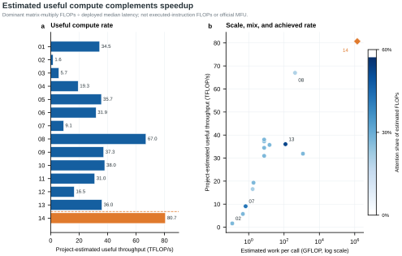
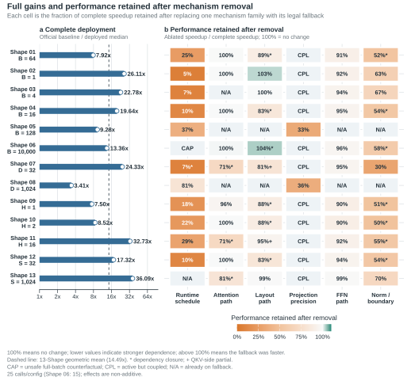
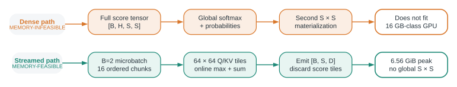
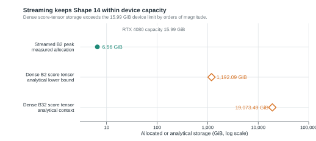

# 4. Evaluation and Results

## 4.1 Declared snapshot

This section reports the completed local artifact dated `2026-08-31T08:38:57.848038Z`. The test variant uses FP32 input/output, `padding_ratio=0.0`, and `input_scale=1.0`. All GPU work was run through the project's exclusive device lease and fresh-process Shape suite.

*Figure 6. Shapes 01–13 achieve a 14.49× geometric-mean speedup, while the absolute-latency panel distinguishes relative acceleration from actual execution time.*

## 4.2 Metrics

For Shapes 01–13, per-Shape speedup is

\[
s_i = \frac{\text{baseline median latency}_i}
           {\text{deployed median latency}_i}.
\]

The headline aggregate is the equal-Shape geometric mean

\[
G = \exp\left(\frac{1}{13}\sum_{i=1}^{13}\log s_i\right)=14.4926.
\]

Equivalently, \(\log G\) is the arithmetic mean of the per-Shape log speedups. Each resident Shape therefore receives equal weight in multiplicative performance space, and reversing baseline and deployment replaces \(G\) with \(1/G\). This is the standard rationale for geometrically aggregating normalized benchmark ratios; the report retains the per-Shape values and range because an aggregate alone cannot represent workload variability ([Fleming and Wallace, 1986](https://doi.org/10.1145/5666.5673)).

P90 is a latency percentile from the deployed timing samples; it is not an error bar or confidence interval. Peak memory is the project-reported maximum allocated GPU memory. Correctness uses the official elementwise absolute-or-relative tolerance logic. This aggregate is an internal engineering summary, not the unpublished official MFU-weighted competition score.

To complement relative speedup with useful-work scale, the report also uses the project's dominant-matrix-operation estimate

\[
\widehat{F}=L\left(2BS^2D+8BSD^2+4BSDF\right),\qquad
\widehat{T}=\frac{\widehat{F}}{10^9t_{ms}}.
\]

This estimate covers the principal attention, projection, and FFN matrix multiplications. It excludes elementwise work and is not executed FLOPs, hardware-counter throughput, roofline efficiency, or official MFU.

## 4.3 Per-Shape results

| Shape | Baseline median (ms) | Deployed median (ms) | Deployed P90 (ms) | Speedup | Peak memory (GiB) | Correctness |
| ---: | ---: | ---: | ---: | ---: | ---: | :---: |
| 01 | 1.7271 | 0.2181 | 0.2191 | 7.92× | 0.027 | PASS |
| 02 | 1.8714 | 0.0717 | 0.0717 | 26.11× | 0.020 | PASS |
| 03 | 1.8665 | 0.0819 | 0.0829 | 22.78× | 0.021 | PASS |
| 04 | 1.9101 | 0.0973 | 0.0983 | 19.64× | 0.016 | PASS |
| 05 | 3.9045 | 0.4209 | 0.4466 | 9.28× | 0.019 | PASS |
| 06 | 491.9541 | 36.8179 | 37.0465 | 13.36× | 1.251 | PASS |
| 07 | 1.7935 | 0.0737 | 0.0737 | 24.33× | 0.012 | PASS |
| 08 | 21.4340 | 6.2807 | 6.6192 | 3.41× | 0.266 | PASS |
| 09 | 1.5126 | 0.2017 | 0.2029 | 7.50× | 0.027 | PASS |
| 10 | 1.6846 | 0.1976 | 0.1987 | 8.52× | 0.027 | PASS |
| 11 | 7.9422 | 0.2427 | 0.2448 | 32.73× | 0.027 | PASS |
| 12 | 1.7558 | 0.1014 | 0.1024 | 17.32× | 0.016 | PASS |
| 13 | 120.4296 | 3.3372 | 3.4683 | 36.09× | 0.199 | PASS |
| 14 | — | 17244.3359 | 17244.3359 | — | 6.563 | PASS |

Shapes 01–13 all pass and produce a **14.49×** geometric mean. The largest measured speedups are Shape 13 (36.09×), Shape 11 (32.73×), and Shape 02 (26.11×). Shape 08 is the lowest at 3.41×, making it a more important optimization target than Shapes already dominated by launch-overhead removal or a highly favorable specialized path.

*Figure 7. Relative speedup and project-estimated useful throughput identify different optimization regimes and should not be interpreted as interchangeable performance measures.*

The throughput view prevents a high speedup from being mistaken for high absolute device utilization. Shape 08 has the lowest relative speedup but the highest resident project-estimated useful throughput (about 67.0 TFLOP/s); Shape 02 has a large 26.11× speedup yet only about 1.64 estimated TFLOP/s because its absolute workload is small. The joint speedup-versus-throughput view makes this distinction explicit without presenting the project FLOP estimate as official utilization or MFU.

## 4.4 Coherent mechanism-family ablation

The project measures legal leave-one-family-out counterfactuals for every resident Shape (01–13). Each counterfactual starts from the complete deployed `ConfigSpec`, replaces one mechanism family with its nearest legal fallback, recompiles the resulting plan, checks correctness and execution-path identity, and then measures the pair on the same fixed input in a fresh process.

*Figure 8. Complete deployed speedup is shown beside family-level counterfactuals for Shapes 01–13. Each right-panel cell reports retained performance, \(S_{\mathrm{ablated}}/S_{\mathrm{complete}}=L_{\mathrm{deployed}}/L_{\mathrm{ablated}}\). Thus 100% means no change, lower values indicate stronger dependence on the removed family, and values above 100% mean the legal fallback was faster in this compact run. Gray cells are inapplicable, coupled, or capacity-excluded. Asterisks mark dependency closures and plus signs mark partial family isolation. The percentages are non-additive removal sensitivities, not shares of total speedup.*

The full-deployment panel uses the declared final-performance snapshot. The ablation panel uses one correctness trial, two warmups, five timed calls per round, and five alternating paired rounds; Shape 06 uses three rounds, for 15 timed calls per configuration, because its large batch makes repeated measurement disproportionately expensive. The complete 446.266-second run contains 78 Shape-family cells: 56 executable counterfactuals were measured and all passed correctness and execution-path checks; 10 cells were already on their fallback path; 11 active mechanisms were too coupled to isolate honestly; and one was capacity-excluded. Shape 06's runtime-off variant is marked `CAP` rather than executed because removing batch tiling would expose the full `B=10000` batch and turn an unsafe capacity/timeout experiment into a misleading latency attribution.

The results identify different performance mechanisms rather than one universal recipe:

- removing runtime scheduling leaves only 5–37% of complete performance on Shapes 01–05, 07, and 09–12; Shape 08 retains 81%, while Shape 13 is already on the eager fallback;
- removing norm/boundary specialization leaves 30–70% wherever that family is active, making it the second most consistently material mechanism;
- attention removal leaves 71%, 71%, and 81% on Shapes 07, 11, and 13 respectively, while it is nearly neutral on several other Shapes;
- projection/precision can be cleanly isolated on Shapes 05 and 08, where removal leaves 33% and 36%; on the other optimized plans it is marked `CPL` rather than misreported as an independent effect;
- FFN removal retains 90–99%, and most layout removals retain 81–104%, so their isolated effects are smaller under this deployed composition.

Values slightly above 100% identify a legal fallback that was faster in this compact run; they are follow-up optimization signals, not evidence that family effects sum to the complete baseline speedup. A genuinely additive percentage decomposition would require a substantially larger combination experiment and an interaction-aware estimator such as Shapley values in log-speedup space.

## 4.5 Shape 14

Shape 14 does not materialize the dense `S × S` reference baseline. The full logical-batch latency loop executes 16 ordered, distinct `B=2` streamed forwards and retains only a compact summary between chunks. The measured 17.244 s covers that complete logical-batch loop and passes correctness. The reported 6.56 GiB is the maximum allocated memory of one `B=2` inner streamed forward; it excludes allocator-reserved memory and is not a measurement of one materialized `B=32` call. Shape 14 is excluded from the speedup geometric mean.

The result artifact records a project estimate of `1,391,250,636,800,000` model FLOPs. Dividing this estimate by the measured latency gives approximately **80.7 project-estimated TFLOP/s**. This is not official MFU: the official useful-FLOP definition, device denominator, Shape weights, and bandwidth correction have not been published.

*Figure 9. Ordered `B=2` microbatches compute causal attention online and write into one preallocated logical-batch output without retaining a global `S × S` score tensor.*

*Figure 10. The measured 6.56 GiB streamed inner-forward peak fits the validated device, whereas analytical dense-score lower bounds for `B=2` and `B=32` exceed its capacity by orders of magnitude.*

For scale, a single FP32 dense attention-score tensor at `B=2` would require at least 1,192 GiB; at the full logical `B=32`, it would require at least 19,073 GiB. The 1,192 GiB lower bound is about 182 times the measured 6.56 GiB inner-forward peak, before accounting for QKV, outputs, FFN state, and temporary buffers. This is capacity evidence for online/streamed attention, not a dense-baseline latency comparison.

## 4.6 Measurement protocol interpretation

The resident final preset normally uses five correctness trials, 20 warmups, 100 repeats, and three rounds. Shape 06 deliberately uses one correctness trial, two warmups, five repeats, and three rounds because its very large batch makes repeated validation disproportionately expensive. Shape 14 uses one correctness trial, no additional warmup, one full-batch repeat, and one round in the final reporting script; its P90 therefore equals its median by construction and is not tail-latency evidence.

The project measures with CUDA Events, fixed inputs per comparison, alternating baseline/candidate order where applicable, one GPU lease, and a fresh process per Shape. Previous development runs showed that external GPU activity can materially distort sub-millisecond measurements. The result above should therefore be read as a declared exclusive-device snapshot, not averaged with older, differently loaded runs.

## 4.7 What the evidence supports

The results support three claims:

1. shape-specialized execution materially outperforms the supplied PyTorch reference across all resident workloads on the disclosed RTX 4080 stack;
2. no single speedup trend explains batch, width, head-count, and sequence variation;
3. a streamed implementation makes Shape 14 feasible without a dense attention matrix.

The current artifact does not support resident MFU, a cross-hardware performance claim, a confidence interval across independent machine runs, or an official score.

## 4.8 Source

- Machine-readable result: [final_performance.json](../../result/20260831T083857.848038Z/final_performance.json)
- Human-readable result: [final_performance.md](../../result/20260831T083857.848038Z/final_performance.md)
- Raw mechanism-family ablation: [ablation.json](../../result/ablation/20260901T002918.287640Z/ablation.json)
- Figure source data: [`figures/source_data/`](figures/source_data/)
